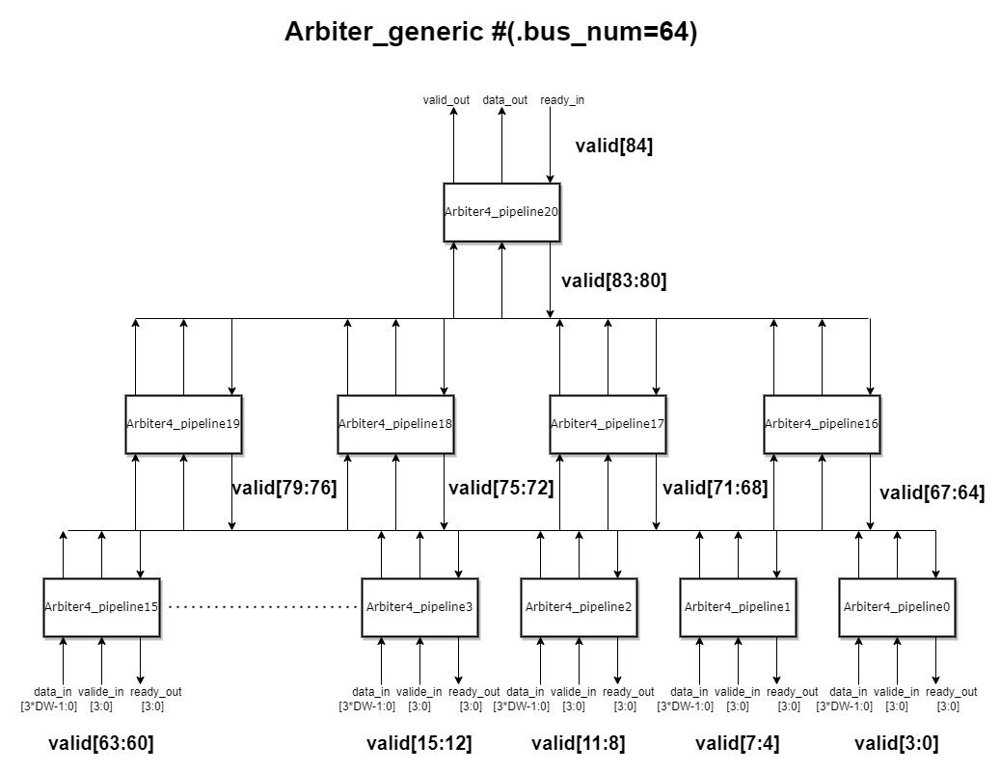

# Arbiter32
1) 实现一个4路总线仲裁器，按照轮询（Round Robin）的方式，每次选出一路有数据的总线进行传输；
2) 基于前面实现的4路总线仲裁器，实现一个树形32路总线仲裁器，树的每个节点是一个4路总线仲裁器，一共有32路总线输入，最后选出来一路有数据的总线进行传输。

3) 对前面树形32路总线仲裁器的时序进行优化，树的每个节点（4路总线仲裁器）的输出用寄存器打拍，注意要分别处理对总线的valid和数据以及ready信号打拍。

4) 仿真要求体现高性能传输无气泡、逐级反压、传输不丢数据。

# Arbiter_generic说明
Arbiter_generic实现了根据总线数量(bus_num)生成由4路总线轮询仲裁器为基本单元构成的树形总线仲裁器，并对树的每个节点进行打拍。

### 本文内容
- [端口与参数说明](https://github.com/Yoannez/Arbiter32/edit/main/README.md#%E7%AB%AF%E5%8F%A3%E4%B8%8E%E5%8F%82%E6%95%B0%E8%AF%B4%E6%98%8E)
- [函数说明](https://github.com/Yoannez/Arbiter32/edit/main/README.md#%E5%87%BD%E6%95%B0%E8%AF%B4%E6%98%8E)
- [内部信号与内部参数说明](https://github.com/Yoannez/Arbiter32/edit/main/README.md#%E5%86%85%E9%83%A8%E4%BF%A1%E5%8F%B7%E4%B8%8E%E5%86%85%E9%83%A8%E5%8F%82%E6%95%B0%E8%AF%B4%E6%98%8E)
- [树形仲裁器结构说明](https://github.com/Yoannez/Arbiter32/edit/main/README.md#%E6%A0%91%E5%BD%A2%E4%BB%B2%E8%A3%81%E5%99%A8%E7%BB%93%E6%9E%84%E8%AF%B4%E6%98%8E)

## 端口与参数说明
```
module arbiter_generic
#(
	parameter bus_num = 32,
	parameter DW	  = 8
)
(	input clk,rst,
	input ready_in,
	input [bus_num-1:0] valid_in,
	input [bus_num*DW-1:0] data_in,
	output [bus_num-1:0] ready_out,
	output [DW-1:0] data_out,
	output valid_out
);
```
### 参数说明
- **bus_num**: 输入端总线数量。
- **DW**: data width数据位宽。
### 端口说明
- **clk, rst**: 时钟以及复位信号。
- **ready_in, valid_out, data_out**: 分别是上游端给出的ready信号，以及接收到的valid和data信号。
- **ready_out, valid_in, data_in**: 分别是下游端收到的ready信号，以及给出的valid和data信号。

## 函数说明
### getWidth
根据输入总线数量计算出内部信号的宽度。
```
function integer getWidth;
	input integer bus_num;
	integer k;
	begin
		getWidth = 0;
		for (k=bus_num; k>0; k=k/4) begin
			getWidth = getWidth + k;
		end
	end
 endfunction
```

### getArbiterNum
根据输入总线数量计算出所需的4路轮询仲裁器数量。
```
function integer getArbiterNum;
	input integer bus_num;
	integer k;
	begin
		getArbiterNum = 0;
		for (k=bus_num/4; k>0; k=k/4) begin
			getArbiterNum = getArbiterNum + k;
		end
	end
endfunction
```

## 内部信号与内部参数说明
### 内部信号
共三个内部信号：**ready, valid, data**。

这三个信号包含了Arbiter_generic结构中所有的**内部信号**以及**输入输出端口信号**。

信号的位宽由内部参数WIDTH定义。
### 内部参数
- WIDTH: 由[getWidth](https://github.com/Yoannez/Arbiter32/edit/main/README.md#getwidth)计算得出。
- ARBITER_NUM: 由[getArbiterNum](https://github.com/Yoannez/Arbiter32/edit/main/README.md#getarbiternum)计算得出。

## 树形仲裁器结构说明
这里以64路仲裁器为例：


**内部信号(valid, ready, data)与端口的连接**：
```
assign ready[WIDTH-1] = ready_in;
assign valid[bus_num-1:0] = valid_in;
assign data[bus_num*DW-1:0] = data_in;
assign ready_out = ready[bus_num-1:0];
assign valid_out = valid[WIDTH-1];
assign data_out = data[DW*WIDTH-1:DW*(WIDTH-1)];
```
在此例中，input valid_in的值赋给了valid[63:0], valid[84]的值赋给了output valid_out，其他信号同理。

**Generate例化过程：**
```
generate
  genvar i;
  for (i=0; i<ARBITER_NUM; i=i+1) begin
		arbiter4_pipeline #(.DW(DW))
		arbiter_tree
		(
				.clk		(clk),
				.rst		(rst),
				.valid_in	(valid[4*(i+1)-1 -: 4]),
				.data_in	(data[DW*4*(i+1)-1 -: 4*DW]),
				.ready_out	(ready[4*(i+1)-1 -: 4]),
				.valid_out	(valid[WIDTH-ARBITER_NUM+i]),
				.data_out	(data[DW*(WIDTH-ARBITER_NUM+i+1)-1 -: DW]),
				.ready_in	(ready[WIDTH-ARBITER_NUM+i])
			);
	end
endgenerate
```
arbiter4_pipeline0的valid_in为valid[3:0]，valid_out为valid[64]。

此时 [WIDTH](https://github.com/Yoannez/Arbiter32/edit/main/README.md#%E5%86%85%E9%83%A8%E5%8F%82%E6%95%B0) - [ARBITER_NUM](https://github.com/Yoannez/Arbiter32/edit/main/README.md#%E5%86%85%E9%83%A8%E5%8F%82%E6%95%B0) = 64。
